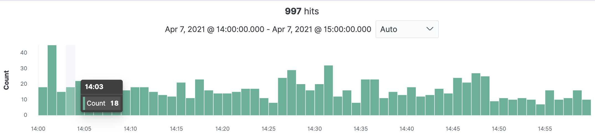
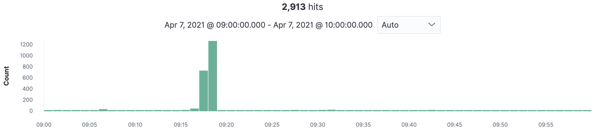
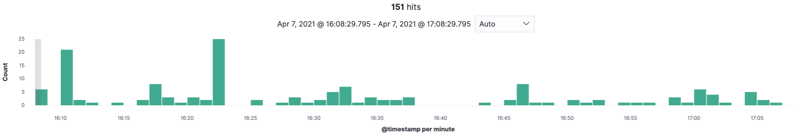
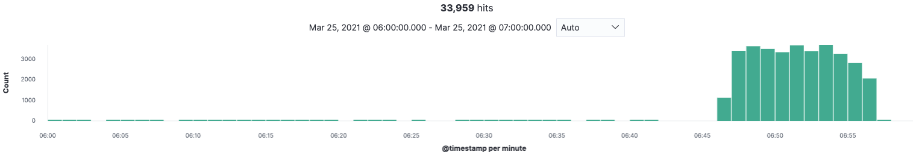

# PagerDuty: slo-application-2.prod-browse.5xx-errors

**Summary:** The Service is generating 5xx errors

**Customer Impact:** Errors

**Actions:**

## Is there a bigger issue?

Join and check the following channels

- [#topic-major-incident-comms](https://link/to/slack)
- [#topic-ops-bridge](https://link/to/slack)
- [#team-platform](https://link/to/slack)

Read and gain and understand what is happening so you have context, if there is a major incident(MI) in progress. Participate and add relevant notes, e.g.
`Application-2 received a 5xx alert at xx:xx`

If there is no MI, keep investigating the Application-2 issue.

You will need to determine if Application-2 is the cause of the problem or suffering symptoms because of a dependency issue.

## Checking Application-2

### Rule in/out our application

Check the [4 golden signals dashboard](https://link/to/dashboard)

Is there:

- A sustained drop in traffic and availability?
- Has latency risen?
- Is CPU usage growing?
- Is Memory saturation growing
- Has the number of replicas spiked up or down? Has it remained there?

---

### Is this a bot?

**Diagnosis:**

Check the past 1 hour activity through [DOWNSTREAM_DEPENDENCY_B](https://link/to/logs)

Look for high frequency patterns of the same client IP address

_Normal activity_

_Unusual activity_

**Remedial Action:**

- Inform [#team-x](https://link/to/slack/channel)
- If there is an incident in progress, inform in the incident channel

---

### Is UPSTREAM_DEPEDENCY_A functional?

**Diagnosis:**

Check the past 1 hour activity through [API Cache](https://link/to/specific/log/query)

_Normal activity_

Low number of hits

_Unusual activity_

High number of hits clustered together

**Remedial Action:**

- Alert Ops Bridge in [#team-a](https://link/to/slack)

---

### Have we performed a duff release?

**Diagnosis:** When was our last release?

**Remedial Action:**

If our neighbours aren’t breaking, consider rollback.

You will need to find the previous pipeline run to production and know how to execute it
